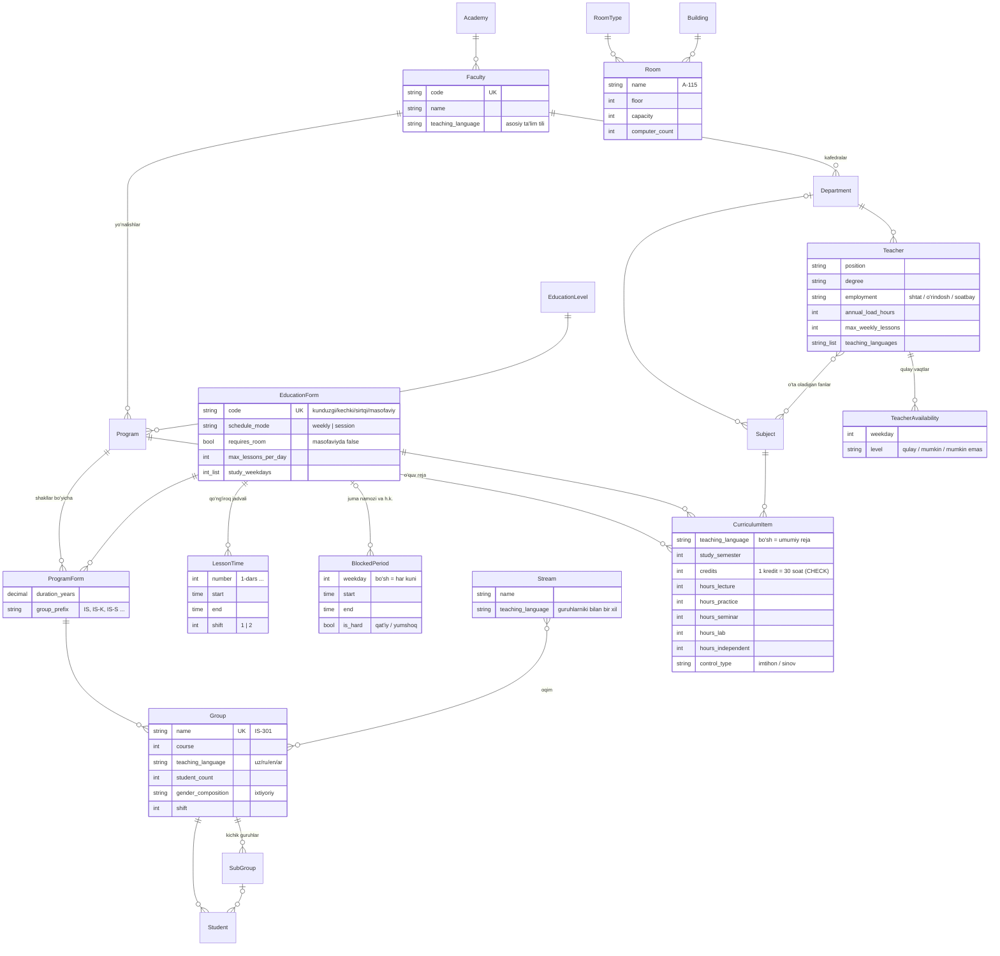
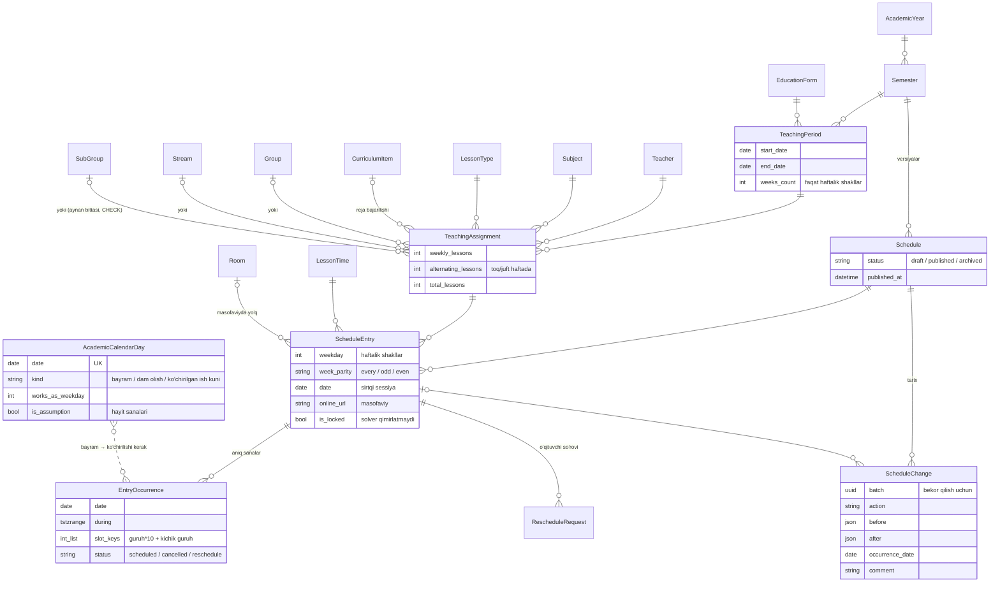

# Ma'lumotlar modeli (ER-diagramma)

Tizim to'rtta Django ilovasidan iborat: `academics` (tuzilma, odamlar, o'quv reja, yuklama),
`scheduling` (jadval versiyalari va darslar), `solver` (avtomatik tuzish) va `notifications` (xabarlar).
`name` maydonlari uch tilda saqlanadi: `name_uz` (majburiy), `name_ru`, `name_en`.

## 1. Tuzilma va o'quv reja



## 2. Kalendar, yuklama va jadval



**Ziddiyatlardan baza darajasida himoya.** Har bir `ScheduleEntry` aniq sanali darslarga
(`EntryOccurrence`) yoyiladi, shuning uchun haftalik va sessiya darslari bitta vaqt o'qida solishtiriladi.
`EntryOccurrence` jadvalida uchta `EXCLUDE USING gist` cheklovi bor (faqat `status = 'scheduled'` uchun):

| Cheklov | Ifoda |
|---|---|
| O'qituvchi | `schedule_id WITH =, teacher_id WITH =, during WITH &&` |
| Xona | `schedule_id WITH =, room_id WITH =, during WITH &&` (xona bo'lsa) |
| Guruh | `schedule_id WITH =, slot_keys WITH &&, during WITH &&` |

`slot_keys`: butun guruh o'zining barcha kichik guruh "o'rinlarini" egallaydi, kichik guruh esa faqat
o'zinikini. Natijada bir guruhning ikki kichik guruhi bir vaqtda o'qiy oladi, lekin butun guruh darsi
ular bilan to'qnashadi. Toq va juft hafta darslarining sanalari kesishmaydi, shu sababli ular ziddiyat emas.

## 3. Avtomatik tuzish va xabarlar

```mermaid
erDiagram
    Semester ||--o{ SolverRun : ""
    Schedule |o--o{ SolverRun : "natija qoralamasi"
    User ||--o{ Notification : ""
    ScheduleEntry |o--o{ Notification : ""
    ScheduleChange |o--o{ Notification : ""
    User ||--o{ PushSubscription : ""
    User ||--o| NotificationPreference : ""
    User |o--o| Teacher : ""
    User |o--o| Student : ""

    User {
        string role "admin/dekanat/kafedra_mudiri/oqituvchi/talaba"
        string language "ilova tili: uz/ru/en"
        fk faculty "dekanat doirasi"
        fk department "kafedra doirasi"
    }
    SolverRun {
        string algorithm "cpsat (keyin: genetic)"
        json params "og'irliklar, vaqt limiti"
        string status
        float objective
        int lessons_placed
        int hard_violations
        json soft_violations
        json diagnostics "yechim yo'q bo'lsa sabablar"
    }
    Notification {
        string kind
        json params "tilga bog'liq bo'lmagan faktlar"
        string language
        string title
        string body
        string dedup_key "recipient bilan UNIQUE"
        bool is_read
    }
```
